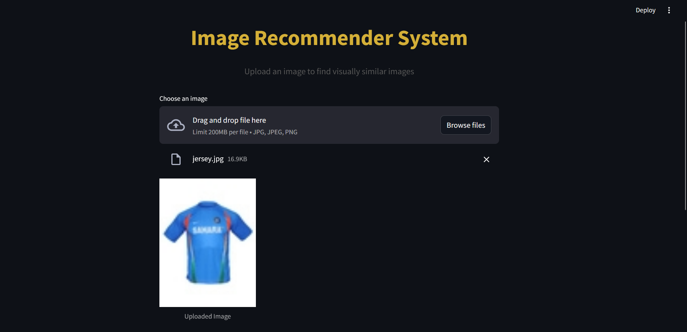
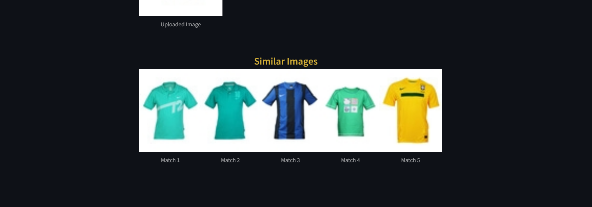

# 🖼 Image Recommendation System

A content-based image recommendation system built using **ResNet50**, **TensorFlow**, and **Streamlit**. This system allows users to upload an image and find visually similar images from a pre-defined dataset.

---
### Acknowledgments
- TensorFlow
- Keras
- Streamlit
- ResNet50
  
##  Features

- Upload an image via a simple web interface.
- Extracts deep features using pre-trained ResNet50 model (without top layer).
- Uses Euclidean distance to find top-5 similar images.
- Real-time recommendation with a clean, responsive UI.
- Built with Python, TensorFlow, Keras, NumPy, Scikit-learn, and Streamlit.

---

##  Project Structure
📦 Image-Recommendation-System
- app.py                # Script to extract features and generate embeddings
-  main.py               # Main Streamlit application
-  embeddings.pkl        # Stored image embeddings
-  filenames.pkl         # Filenames corresponding to embeddings
-   images/               # Folder containing all reference images
- uploads/              # Temporary upload directory for user images
-  requirements.txt      # Python dependencies
-   README.md             # Project documentation

## 🛠️ Installation

1. **Clone the repository**
   ```bash
   git clone https://github.com/ayu-ano/Image-Recommendation.git
    ```
    ```
   cd Image-Recommendation-System
     ```

2. **Create virtual environment**
 ```bash
python -m venv venv
```

# Activate on Linux/macOS
 ```bash
source venv/bin/activate
```

# Activate on Windows (CMD/PowerShell)
 ```bash
virtual\Scripts\activate
```
## if any issue occurs in Windows then first use this cmd then activate the venv(here venv named as virtual)
```
Set-ExecutionPolicy -ExecutionPolicy RemoteSigned -Scope Process
```

3. **Install dependencies**
 ```bash
pip install -r requirements.txt
```

##  Usage

### 🔹 Step 1: Prepare Image Embeddings
1. Place your reference images inside the `images/` directory
2. Run the feature extraction script:

```bash
python main.py
```
This script will:

- Extract features for all images in the directory
- Save the embeddings to `embeddings.pkl`
- Save the corresponding filenames to `filenames.pkl`


### 🔹 Step 2: Start the Streamlit App
bash
```
streamlit run app.py
```
- Navigate to http://localhost:8501 in your browser.

- Upload a .jpg, .jpeg, or .png image.

- The app will display similar images based on visual features.

## 🖼️ Demo

Below is a sample demonstration of how the image recommendation works. Upload any image, and the system will return the top 5 visually similar images from the dataset.

<p align="center">
  
  
</p>


### How it Works
- Uses ResNet50 (pre-trained on ImageNet) to extract deep features.
- Applies Global Max Pooling to flatten feature maps.
- Normalizes feature vectors using L2 norm.
- Uses K-Nearest Neighbors (KNN) with Euclidean distance to retrieve similar images.


  
